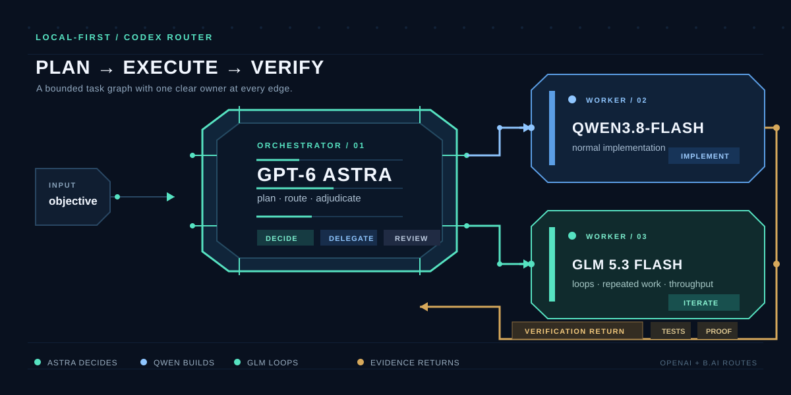

# SilvIA - Astra orchestrator

Astra is a small, local-first routing skill for Codex. GPT-6 Astra plans and
adjudicates; it does not write code or own the workspace. Codex remains the
runtime and delegates bounded implementation work to callable handlers:

- Qwen3.8-Flash handles normal implementation.
- GLM 5.3 Flash handles loops, repeated iteration, and high-throughput work.
- DeepSeek-V4-Flash handles only unusually large-context implementation items and consumes paid Credits.
- GPT-6 Astra remains outside the implementation graph for planning and final
  adjudication.

The skill calls GPT-6 Astra through the B.AI Responses API and consumes callable
handler routes supplied by the Codex runtime. It does not ship a proxy,
dashboard, model catalog, credential store, or API key.

The Astra helper uses the B.AI endpoint https://api.b.ai/v1 with model
gpt-6-astra. It accepts APIKEY_B_AI, the variable used by the supplied
reference script, or the standard BAI_API_KEY name. The GLM handler uses the
same B.AI endpoint with model glm-5.3-flash. The helper never prints or stores
credentials.

## Repository layout

    skill/astra/
    ├── SKILL.md
    ├── agents/openai.yaml
    └── scripts/
        ├── ask_astra.sh
        └── ask_astra.py
    assets/astra-orchestrator.svg
    install.sh
    tests/test_skill.sh

## Install

From this repository, using Git Bash or a working WSL shell:

    ./install.sh --dry-run
    ./install.sh --copy

The skill is installed at ~/.codex/skills/astra. Use --target DIR to select
another skills directory:

    ./install.sh --copy --target "$PWD/.local/codex/skills"

On Windows without a working Bash shell, copy the skill/astra directory to
C:\Users\<user>\.codex\skills\astra manually.

Set the B.AI key locally before using the helper:

    export APIKEY_B_AI="your-b.ai-key"

Or in PowerShell:

    $env:APIKEY_B_AI = "your-b.ai-key"

Never put an API key in an orchestration packet or chat prompt. Start a new
Codex task after installing or changing this skill.

## Use

Invoke the skill with an objective:

    $astra build the feature

To choose a handler explicitly:

    $astra implement the feature; handler: qwen3.8-flash
    $astra repeat this migration across all files; handler: glm-5.3-flash

Astra returns a bounded task graph. Codex validates it, starts callable
handlers, collects evidence, runs verification, and asks Astra to adjudicate
when another decision is needed. Qwen3.8-Flash is preferred for ordinary
implementation. GLM 5.3 Flash is preferred for loops and high-throughput
mechanical work.

The runtime must expose the handler routes as callable. DeepSeek is selected only for large-context items. The skill does not
invent provider aliases or silently substitute another model when a route is
unavailable.

## Direct helper call

    printf '%s' "Plan the implementation of X" |
      "$HOME/.codex/skills/astra/scripts/ask_astra.sh"

Optional settings:

- ASTRA_MODEL, default gpt-6-astra
- ASTRA_BASE_URL, default https://api.b.ai/v1
- ASTRA_REASONING_EFFORT, default low
- ASTRA_MAX_OUTPUT_TOKENS, default 32768
- ASTRA_TIMEOUT_SECONDS, default 900

## Test

    tests/test_skill.sh

The checks are dependency-light and do not call B.AI. They validate shell and
Python syntax, installation, routing strings, SVG safety, and credential-shaped
string scans.

## License

MIT. See LICENSE.

## LangChain implementation workflow

The repository also contains `workflow/`, a standalone B.AI-backed LangChain
runtime for the SDD workflow. It uses GLM-5.3-Flash as the default orchestrator,
Qwen3.8-Flash as the default coder/PR handler, GLM-5.3-Flash as reviewer, and DeepSeek-V4-Flash only for large-context items; it runs independent
work items in parallel when their file ownership is disjoint.

The workflow stops at every harness boundary: a plan must validate, reviewers
must pass, configured checks must succeed, and PR creation requires the separate
`--open-pr` authorization. It never commits or pushes. See
[workflow/HARNESS.md](workflow/HARNESS.md) and
[workflow/README.md](workflow/README.md).

Install its dependencies with `python -m pip install -e .`, then run:

    python -m workflow.cli "Implement the selected specification" --repo . --check "bash tests/test_skill.sh"

## Intervenções e retomada

O workflow agora pausa com uma mensagem timestamped quando encontra erro,
mostra a ação sugerida e solicita autorização explícita para retry ou abort.
Tarefas independentes continuam, quando possível, e o estado fica salvo em
.workflow/sessions/<session-id>/.

Para retomar uma sessão pausada:

    python -m workflow.cli --repo /path/to/nexor_hub --resume <session-id> \
      --check "uv run ruff check ." --check "uv run pytest tests/ -v"

A retomada reutiliza o plano e os outputs já concluídos. Credenciais não são
persistidas, e commit, push, PR, migration e deploy permanecem autorizações
separadas.
